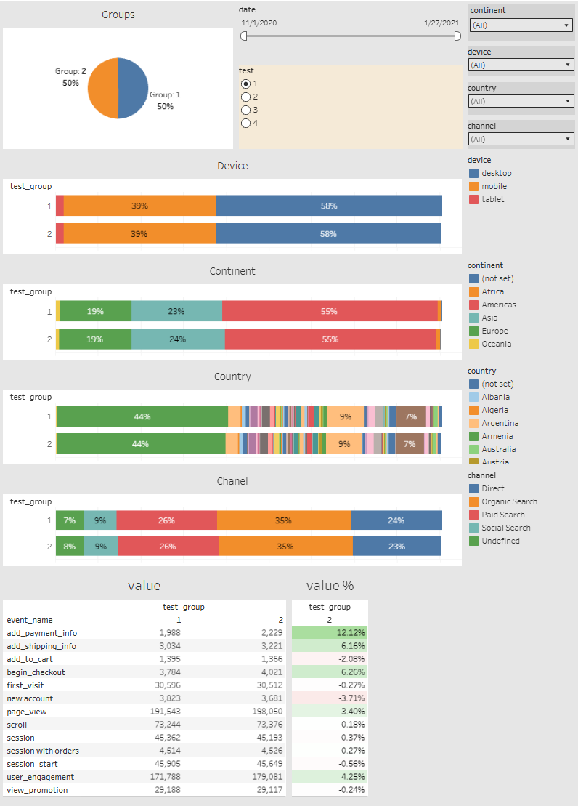
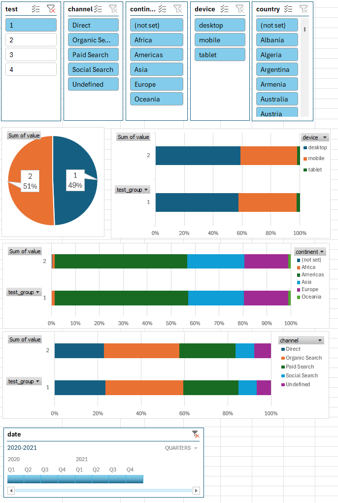
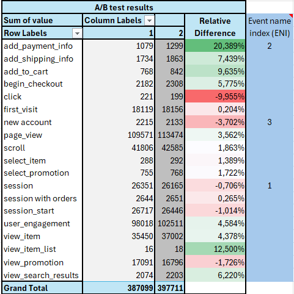
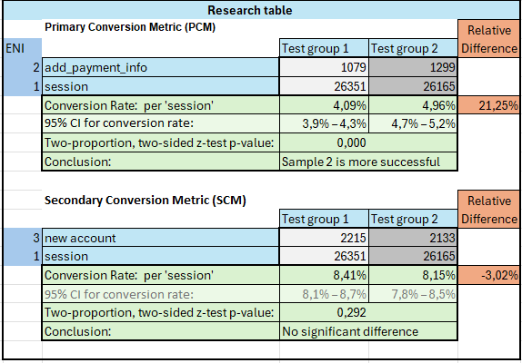
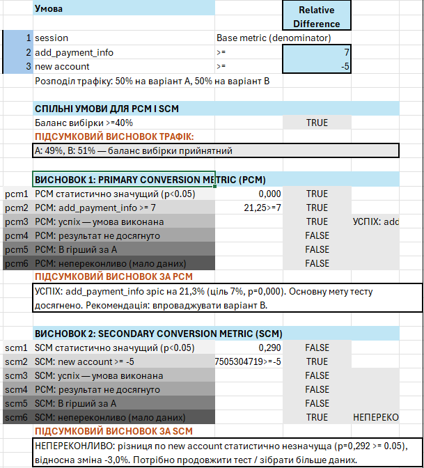
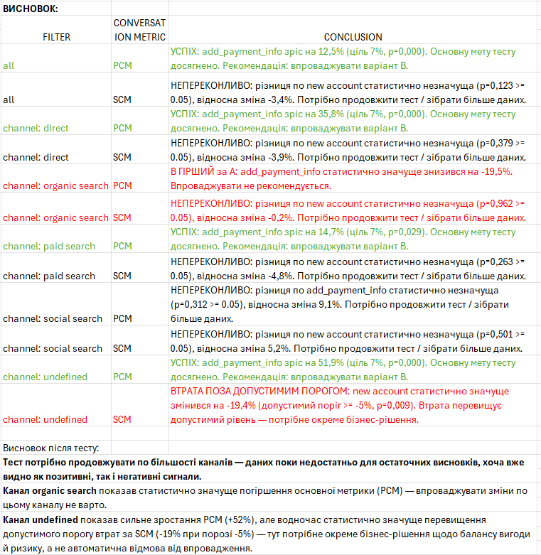

# 🧪 A/B Testing

> [← Back to Portfolio](../README.md)

*Tech stack:* SQL (BigQuery) · Excel (pivots, z-test) · Tableau

**[▶ Open Live Dashboard](https://public.tableau.com/app/profile/artem.makovskyi/viz/ABTEST_17848154968170/ABtest)**

**[▶ Download AB-Testing conclusion and calculations.xlsx](https://drive.google.com/uc?export=download&id=15jZbn_S5cadXUCjm2huYjlBo4_fyCOZS).**

---

## What the dashboard shows

Results of an A/B test on web analytics data: 4 tests, each split into two groups 50/50 (Nov 2020 – Jan 2021).

- **Fairness check** — both groups have the same traffic composition by device, continent, country and channel, so the comparison is valid
- **Event comparison** — how many times each event (page_view, begin_checkout, add_payment_info, …) happened in Group 1 vs Group 2, in absolute numbers and in %
- **Filters** — date range, test number, continent, device, country, channel

---

## Excel analysis

The Excel file ([`AB-Testing conclusion and calculations.xlsx`](https://drive.google.com/uc?export=download&id=15jZbn_S5cadXUCjm2huYjlBo4_fyCOZS).
### Pivot tables & charts

- **Pivot table** — event counts by group, plus a *Relative Difference* column (Group 2 vs Group 1) with color highlighting of the biggest shifts
- **Charts built on the pivots** — group split pie, and stacked bars showing that device / continent / channel distributions match between groups (SRM check), with slicers for test, channel, continent, device, country and date

### A/B test results

Event counts by group with the *Relative Difference* lift for every event (ENI — event name index: 1 = base metric `session`, 2 = primary `add_payment_info`, 3 = secondary `new account`):

### Research table

Conversion metrics for the key events are pulled from the pivot by ENI via `INDEX/MATCH` and feed the whole conclusion pipeline:

| Row | What it is |
|-----|-----------|
| **Conversion Rate** | conversions ÷ sessions for each group |
| **95% CI** | confidence interval around each conversion rate |
| **Z-TEST p-value** | two-proportion, two-sided z-test between the groups |
| **Conclusion** | plain-text decision based on p < 0.05 |

| Metric | Sample 1 | Sample 2 | Relative Difference | p-value | Conclusion |
|--------|----------|----------|---------------------|---------|------------|
| **Primary:** add_payment_info / session | 4.09% | 4.96% | **+21.25%** | 0.000 | Sample 2 is more successful |
| Secondary: new account / session | 8.41% | 8.15% | −3.02% | 0.292 | No significant difference |

### Automated conclusions (`Dashboard_research!Q29:V54`)

Formula block that turns the metrics into ready-to-read decisions:

| Rule | What it checks |
|------|----------------|
| **Sample balance** (`T30`) | `MIN(group share) ≥ 40%` — otherwise traffic is imbalanced and the test must stop |
| **pcm1–pcm6** | p < 0.05, relative lift ≥ **+7%** target → *SUCCESS* / *result not reached* / *B worse than A* / *inconclusive* |
| **scm1–scm6** | p < 0.05, acceptable loss ≥ **−5%** threshold → *improvement* / *result not reached* / *loss beyond threshold* / *inconclusive* |
| **R42 / R53** | final concatenated PCM / SCM verdict in plain text |

### `research_conclusion` sheet

Cumulative sheet that stores research outcomes over time:

**Final verdict:** keep the test running on most channels — data is not yet conclusive, though both positive and negative signals are visible. Do **not** roll out changes for *organic search* (significant PCM regression). For *undefined*, PCM is up +52% but SCM loss exceeds the allowed threshold — needs a separate benefit/risk business decision rather than an automatic rollout.

---

## SQL query

Session metrics for the test are extracted from BigQuery with one query — [read the walkthrough and full SQL →](SQL_Query.md)

---

## Skills Demonstrated

`A/B Testing` `SQL (BigQuery)` `Z-test` `Confidence Intervals` `Excel PivotTables` `Decision Rules` `Segmentation` `Tableau`
