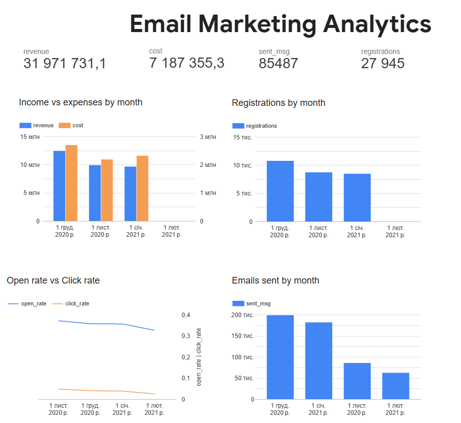

# Looker Studio Projects

> [← Back to Portfolio](../README.md)

---

## Dashboard

Interactive dashboard built in Google Looker Studio, powered by a BigQuery SQL query as its data source. The query calculates cumulative revenue against a predicted goal and displays the percentage of goal achieved over time.

[Open in Looker Studio](https://datastudio.google.com/u/0/reporting/70e10351-16bd-4f90-bbe8-98911a93d200/page/tEnnC)

[](https://datastudio.google.com/u/0/reporting/70e10351-16bd-4f90-bbe8-98911a93d200/page/tEnnC)

### SQL Query (BigQuery)

The dashboard uses a SQL query with three Common Table Expressions (CTEs) to prepare the data:

- **`daily_revenue`** — Aggregates actual daily revenue from sessions, orders, and products.
- **`daily_predict`** — Pulls predicted revenue values from a pre-calculated predictions table.
- **`collect_date`** — Merges actual and predicted data via `UNION ALL` and groups by date.

The final `SELECT` computes cumulative sums and the goal completion percentage using window functions (`SUM OVER`).

```sql
WITH
  daily_revenue AS (
    SELECT
      s.date,
      SUM(p.price) AS revenue,
      0 AS predict
    FROM `DA.session` s JOIN `DA.order` o
      ON o.ga_session_id = s.ga_session_id
    JOIN `DA.product` p ON p.item_id = o.item_id
    GROUP BY s.date
  ),
  daily_predict AS (
    SELECT
      date,
      0 AS revenue,
      predict
    FROM `DA.revenue_predict`
  ),
  collect_date AS (
    SELECT
      date,
      SUM(revenue) AS revenue,
      SUM(predict) AS predict
    FROM
      (
        SELECT *
        FROM daily_revenue
        UNION ALL
        SELECT *
        FROM daily_predict
      )
    GROUP BY date
  )
SELECT
  date,
  SUM(revenue) OVER (ORDER BY date) AS cumulative_revenue,
  SUM(predict) OVER (ORDER BY date) AS cumulative_predict,
  SUM(revenue)
    OVER (ORDER BY date) / SUM(predict) OVER (ORDER BY date) * 100 AS percent_of_goal
FROM collect_date
```

Tools: Google Looker Studio, BigQuery, SQL
