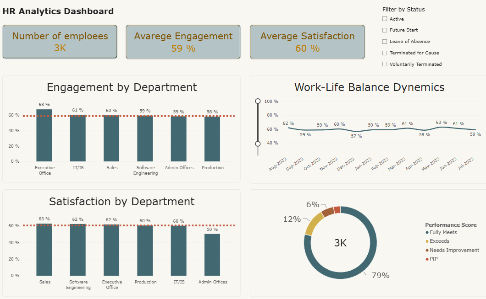
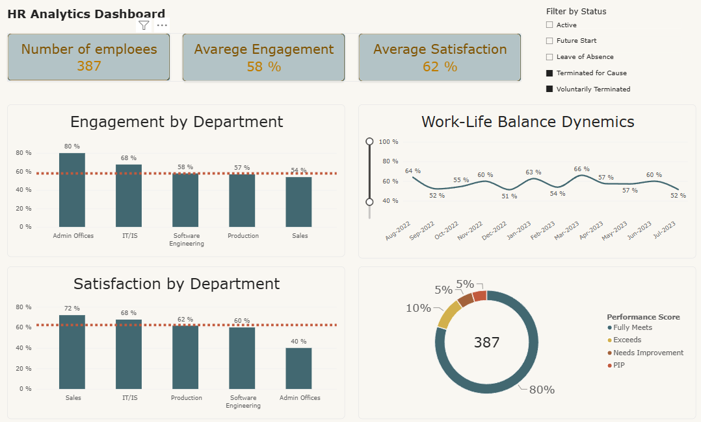

# Power BI Projects

> [← Back to Portfolio](../README.md)

---

## HR Analytics Dashboard

Interactive HR analytics dashboard for monitoring employee engagement,
satisfaction and work-life balance across departments.

Educational project built on the Kaggle HR Analytics dataset (387 employees,
6 departments). The report provides:

- Company-wide KPIs: engagement (58%), satisfaction (62%), performance distribution
- Department-level comparison of engagement and satisfaction
- Work-life balance trends over time (monthly, Aug 2022 – Jul 2023)
- Employee termination trends by month (2018–2023)
- Interactive filtering by employment status for exploratory analysis

Built in Power BI using data modeling and DAX measures, with dedicated
report pages for each metric: Overview, Engagement, Satisfaction,
Work-Life Balance, and Terminations.

Tools: Power BI, DAX, Data Modeling
Dataset: Kaggle HR Analytics (educational/demo data)

[Download .pbix](https://drive.google.com/file/d/1kRHI6XJp-nRsMpTkGwQlesWWJjdlezoq/view?usp=sharing)