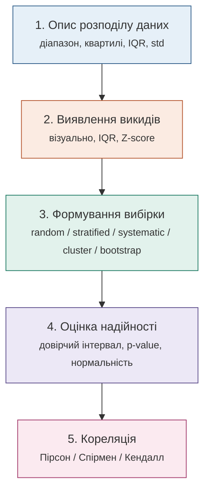
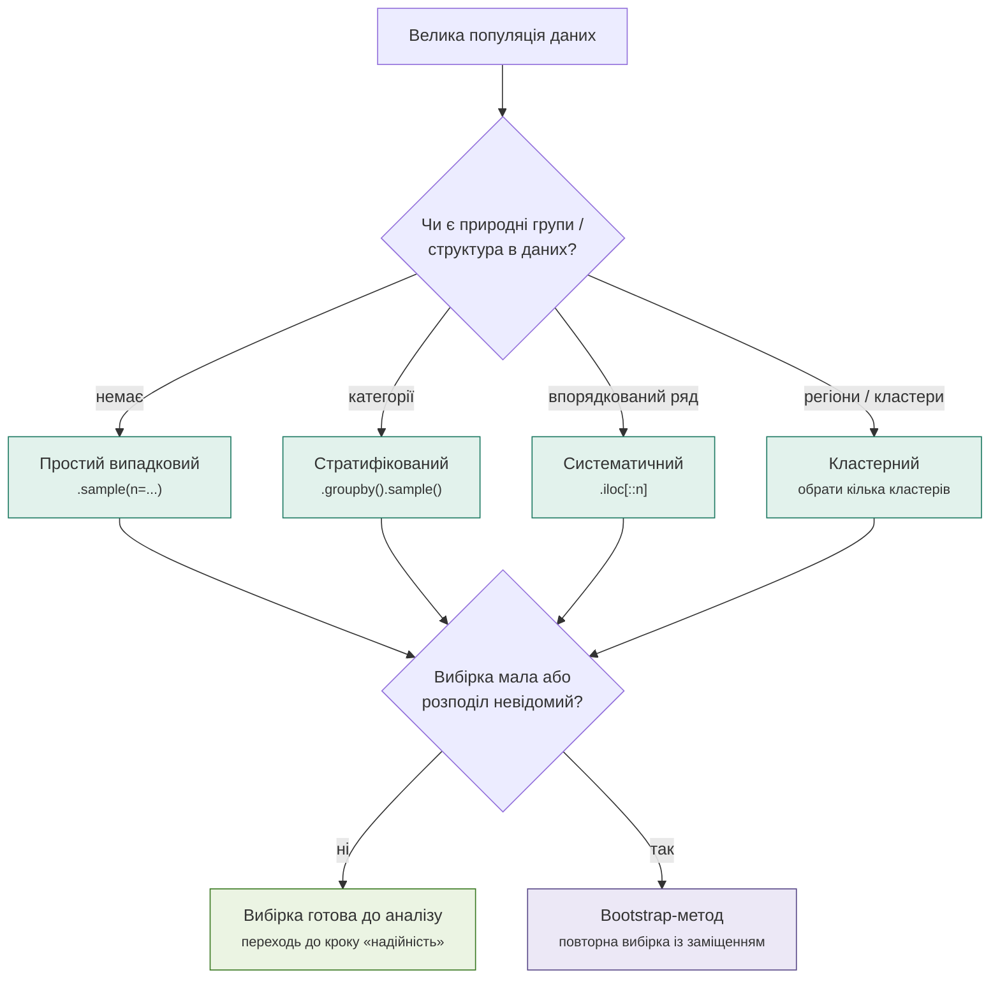
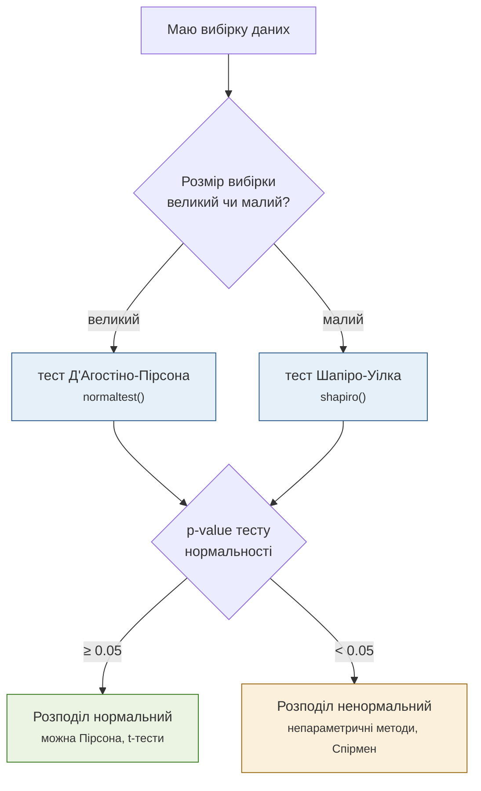
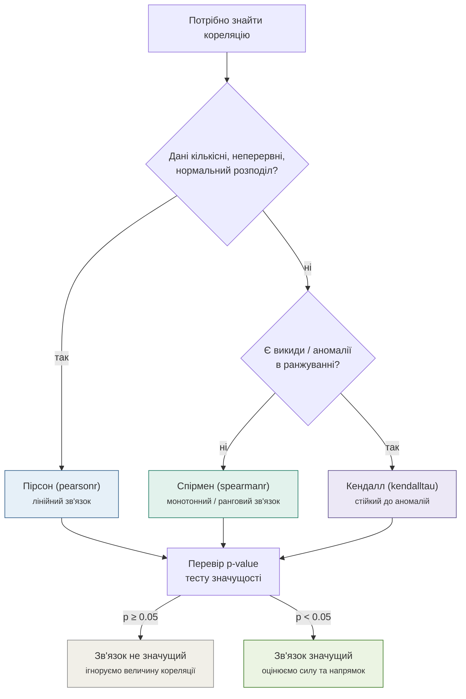

# Карта статистичного аналізу даних

> Mermaid-діаграми рендеряться в GitHub, GitLab, Obsidian, Notion, VS Code (з розширенням Markdown Preview Mermaid Support) та інших сучасних переглядачах markdown. Якщо діаграма не відображається — встав код у [mermaid.live](https://mermaid.live).

---

## 0. Загальна карта аналізу

П'ять послідовних етапів: кожен наступний крок спирається на висновки попереднього.

---

## 1. Виявлення та обробка викидів

```mermaid
flowchart TD
    Start["Є набір даних"] --> Viz["Спочатку візуалізуй<br/>(lineplot / scatterplot)"]
    Viz --> Q{"Видно різкі<br/>піки чи провали?"}

    Q -->|так| IQR["Метод IQR<br/><small>межі: Q1−1.5·IQR / Q3+1.5·IQR</small><br/><small>стійкий до викидів</small>"]
    Q -->|не зрозуміло| Z["Метод Z-score<br/><small>викид, якщо &#124;Z&#124; &gt; 3</small><br/><small>чутливий до викидів</small>"]

    IQR --> Found{"Викид знайдено —<br/>що далі?"}
    Z --> Found

    Found -->|це помилка даних| Remove["Видалити / виправити<br/><small>не впливає на висновки</small>"]
    Found -->|реальна подія<br/>акція, свято| Keep["Залишити й пояснити<br/><small>враховувати у прогнозах</small>"]

    style IQR fill:#FBEBE2,stroke:#B5562F
    style Z fill:#FBEBE2,stroke:#B5562F
    style Remove fill:#F8E5E2,stroke:#A23A2E
    style Keep fill:#EBF4E3,stroke:#3B7A23
```

**Логіка рішень:**
- Якщо аномалія очевидна на графіку → застосовуй **IQR** (стійкіший до екстремальних значень, працює навіть без нормального розподілу).
- Якщо неочевидно → перевір через **Z-score** (краще працює на приблизно нормальних даних, але сам чутливий до викидів, бо рахується через середнє).
- Знайшов викид → з'ясуй причину: технічна помилка → прибрати; реальна подія → залишити й врахувати в прогнозах.

---

## 2. Методи формування вибірки

**Логіка рішень:**
- Немає структури в даних → **простий випадковий вибір**.
- Є категорії (типи товарів тощо) → **стратифікована вибірка** — по рівній кількості з кожної категорії.
- Дані впорядковані (за часом) → **систематична вибірка** — кожен n-й елемент.
- Дані розкидані по регіонах/групах → **кластерна вибірка** — вибрати кілька цілих кластерів.
- Якщо вибірка мала або розподіл популяції невідомий → **bootstrap**, незалежно від обраного методу семплування вище.

---

## 3. Нормальність, довірчий інтервал та p-value

**Логіка рішень:**
- Велика вибірка → **тест Д'Агостіно-Пірсона** (потужніший на великих даних).
- Мала вибірка → **тест Шапіро-Уілка** (надійніший на малих даних).
- p ≥ 0.05 → немає підстав відхиляти гіпотезу про нормальність → можна параметричні методи (Пірсон, t-тести).
- p < 0.05 → розподіл ненормальний → переходь на непараметричні методи (Спірмен, Кендалл).
- Цей самий принцип `p < 0.05` діє для будь-якого тесту значущості далі (кореляція, t-тест, A/B-тест).

---

## 4. Вибір методу кореляції

**Логіка рішень:**
- Кількісні неперервні дані з нормальним розподілом → **Пірсон** (лінійний зв'язок, −1…+1).
- Інакше: якщо немає аномалій → **Спірмен** (монотонний/ранговий зв'язок).
- Інакше: якщо є аномалії → **Кендалл** (найстійкіший до викидів).
- Завжди перевіряй **p-value** перед інтерпретацією величини коефіцієнта:
    - `p ≥ 0.05` → результат міг статись випадково, висновки про зв'язок робити не можна.
    - `p < 0.05` → зв'язок статистично значущий, можна оцінювати силу (`|r|` ближче до 1 — сильніший) і напрямок (знак).

---

## Як користуватись цією картою

1. Почни зі схеми **0** — визнач, на якому етапі аналізу ти зараз.
2. Для відповідного етапу відкрий деталізовану схему (1–4).
3. Рухайся по ромбах-питаннях (умовах) — кожна відповідь веде до конкретного методу або дії.
4. Кінцеві блоки кожної схеми (зелені/кольорові) — це рішення або метод, який треба застосувати.
