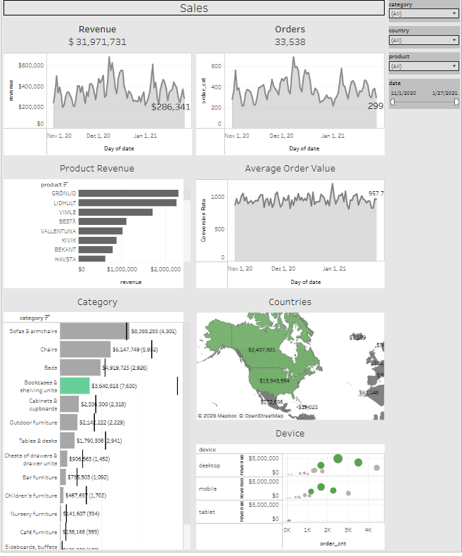
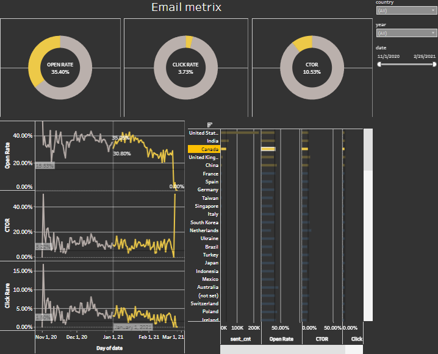
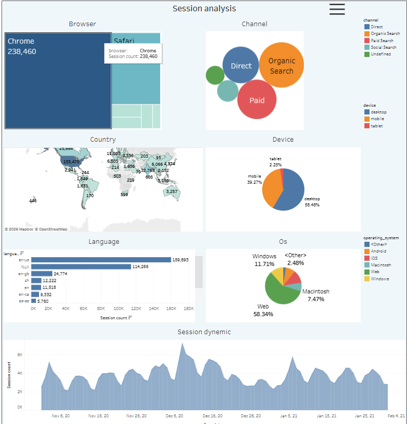
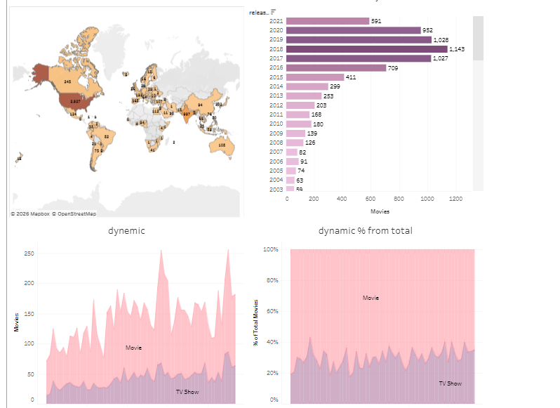

# 📊 Tableau Projects

> [← Back to Portfolio](../README.md)

A collection of interactive business dashboards built in Tableau Public. Each project covers a real-world analytics domain — from e-commerce sales to web session behaviour and email marketing performance.

---

## Projects Overview

### All my dashboards are also available on [Tableau Public](https://public.tableau.com/app/profile/artem.makovskyi/vizzes).

| # | Dashboard | Domain | Key Metrics | Live Link |
|---|-----------|--------|-------------|-----------|
| 1 | [Sales Dashboard](#1-sales-dashboard) | E-commerce / Retail | Revenue, Orders, AOV | [▶ View](https://public.tableau.com/app/profile/artem.makovskyi/viz/sales_17805873094240/Sales) |
| 2 | [Email Metrics](#2-email-metrics) | Email Marketing | Open Rate, CTR, CTOR | [▶ View](https://public.tableau.com/app/profile/artem.makovskyi/viz/emailmetrix_17794634158370/Emailmetrix) |
| 3 | [Session Analysis](#3-session-analysis) | Web Analytics | Sessions, Channels, Devices | [▶ View](https://public.tableau.com/app/profile/artem.makovskyi/viz/Sessionanalysis_17793577148440/Sessionanalysis) |
| 4 | [Netflix Catalogue](#4-netflix-catalogue-analysis) | Exploratory Data Analysis | Content mix, Geography, Trends | [▶ View](https://public.tableau.com/app/profile/artem.makovskyi/viz/Nefflix/Netflix) |

---

## 1. Sales Dashboard

**[▶ Open Live Dashboard](https://public.tableau.com/app/profile/artem.makovskyi/viz/sales_17805873094240/Sales)**

### What it shows
End-to-end retail sales performance for a furniture company (Nov 2020 – Jan 2021). The dashboard answers three core business questions: how is revenue trending, which products and categories drive the most value, and which markets and devices convert best.

### Key Metrics
| Metric | Value |
|--------|-------|
| Total Revenue | $31,971,731 |
| Total Orders | 33,538 |
| Average Order Value | ~$957 |
| Top Product | GRÖNLID |
| Top Category | Sofas & Armchairs ($8.4M) |

### Views & Interactivity
- **Revenue & Orders trend** — daily time series with current-period callouts
- **Product Revenue** — horizontal bar chart, top 8 products ranked by revenue
- **Category breakdown** — revenue + order count per category with reference line
- **Countries map** — revenue by geography (Mapbox)
- **Device scatter** — revenue vs order count split by desktop / mobile / tablet
- **Filters:** category, country, product, date range slider

### Tools & Skills
`Tableau` `Time Series Analysis` `Geographic Visualisation` `KPI Cards` `Interactive Filters`

---

## 2. Email Metrics

**[▶ Open Live Dashboard](https://public.tableau.com/app/profile/artem.makovskyi/viz/emailmetrix_17794634158370/Emailmetrix)**

### What it shows
Email campaign performance tracking across 25+ countries (Nov 2020 – Mar 2021). Designed to surface engagement trends over time and benchmark country-level results against each other.

### Key Metrics
| Metric | Value | Benchmark* |
|--------|-------|------------|
| Open Rate | 35.49% | >20% = good |
| Click Rate | 3.85% | >2% = good |
| CTOR | 10.86% | >10% = good |

\*Industry averages for email marketing.

### Views & Interactivity
- **3 KPI donuts** — Open Rate, Click Rate, CTOR at a glance
- **Trend lines** — daily Open Rate, CTOR, Click Rate over time (notable drop in Jan 2021 visible)
- **Country comparison table** — sent volume, Open Rate, CTOR, Click Rate side by side
- **Filters:** country, year, date range slider

### Notable Insight
Open Rate dropped sharply from ~44% to ~15% in late January 2021 — a clear signal worth investigating (list fatigue, deliverability issue, or content change).

### Tools & Skills
`Tableau` `Marketing Analytics` `KPI Donut Charts` `Trend Analysis` `Cohort Comparison`

---

## 3. Session Analysis

**[▶ Open Live Dashboard](https://public.tableau.com/app/profile/artem.makovskyi/viz/Sessionanalysis_17793577148440/Sessionanalysis)**

### What it shows
Web traffic analysis covering browser usage, acquisition channels, geographic distribution, device mix, and session volume dynamics (Nov 2020 – Feb 2021).

### Key Metrics
| Dimension | Leader | Share |
|-----------|--------|-------|
| Browser | Chrome | 238,460 sessions |
| Device | Desktop | 58.48% |
| OS | Web | 58.34% |
| Channel | Organic Search | largest bubble |
| Language | en-us | 159,893 sessions |

### Views & Interactivity
- **Browser treemap** — Chrome vs Safari vs other browsers by session volume
- **Channel bubble chart** — Direct, Organic Search, Paid, Social, Undefined
- **Country map** — session count per country
- **Device & OS pie charts** — device and operating system breakdown
- **Language bar chart** — top 7 browser languages
- **Session Dynamic** — daily session trend line (Nov 2020 – Feb 2021)
- **Filter:** channel selector

### Tools & Skills
`Tableau` `Web Analytics` `Treemap` `Bubble Chart` `Geographic Map` `Traffic Analysis`

---

## 4. Netflix Catalogue Analysis

**[▶ Open Live Dashboard](https://public.tableau.com/app/profile/artem.makovskyi/viz/Nefflix/Netflix)**

### What it shows
Exploratory analysis of the Netflix content catalogue. Explores the balance between Movies and TV Shows, production geography, release year distribution, and how the catalogue has grown over time.

### Key Metrics
| Content Type | Count | Share |
|---|---|---|
| Movies | 5,766 | 70.2% |
| TV Shows | 2,448 | 29.8% |
| Avg Movie Duration | 101 min | — |
| Avg TV Show Seasons | 2 | — |
| Peak Release Year | 2018 | 1,149 titles |

### Views & Interactivity
- **Content type pie** — Movies vs TV Shows split
- **Duration table** — avg seasons / minutes per type
- **Countries map** — content production by country (USA: 2,527 titles dominant)
- **Release year bar chart** — volume of movies by year (2003–2021)
- **Dynamic area chart** — monthly additions of Movies vs TV Shows (2017–2021)
- **Dynamic % chart** — share of each content type over time
- **Genre trend bars** — drama and comedy counts by month
- **Filters:** country, date_added range, release_year

### Notable Insight
The proportion of TV Shows has been gradually increasing since 2017, reflecting Netflix's strategic shift toward series content.

### Tools & Skills
`Tableau` `Exploratory Data Analysis` `Area Charts` `Geographic Map` `Content Analytics`

---

## Skills Demonstrated Across Projects

| Skill | Projects |
|-------|----------|
| KPI dashboard design | Sales, Email Metrics |
| Time series & trend analysis | Sales, Email Metrics, Session Analysis, Netflix |
| Geographic visualisation | Sales, Session Analysis, Netflix |
| Marketing analytics | Email Metrics |
| Web / product analytics | Session Analysis |
| Exploratory data analysis | Netflix |
| Interactive filters & parameters | All projects |

---

*All dashboards are published on [Tableau Public](https://public.tableau.com/app/profile/artem.makovskyi/vizzes) and fully interactive.*